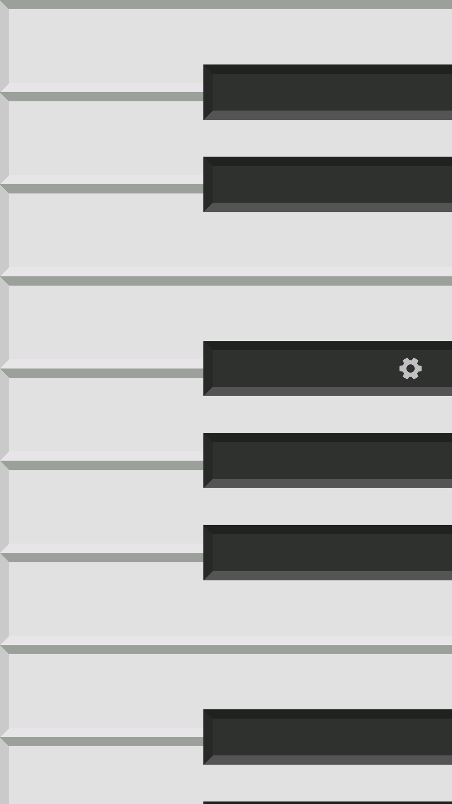
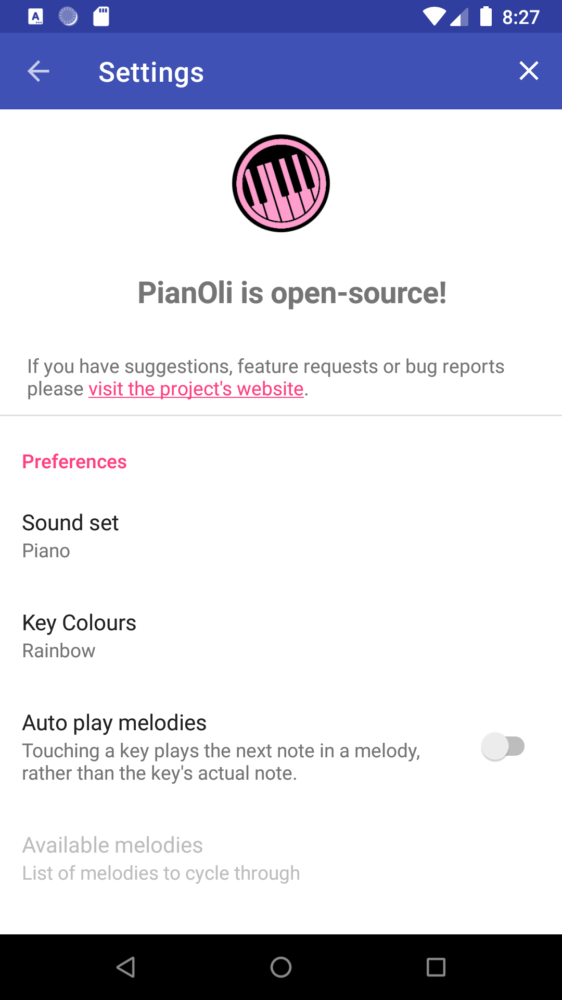

# PianOli

 

A baby game for Android

Have a baby curious about shiny tablets and phones?
Use this app as a baby-game and, more importantly, to prevent random taps of a baby from doing
anything you may not want.

This app will show a small piano a baby can use to explore sounds in a mobile device.
At the same time, it will block any naive attempts at closing the app.
The back, home and apps-menu buttons will be blocked, and Android's top menu won't be available.
This ensures a baby can't accidentally close the game, preventing any actions on the device you
may not want.

Grown ups can unlock the app by touching the settings icon with one finger, then holding the
second setting icon with another finger.

## Screenshots

  

## Contributing

### Reporting Issues

Please report any issues or suggest features on the [issue tracker](https://github.com/nicolasbrailo/PianOli/issues).

### Translating

We use [Weblate](https://hosted.weblate.org/engage/pianoli/) to manage translations. Please see [these instructions for using Weblate](https://hosted.weblate.org/engage/pianoli/) to translate Pianoli.

| Android app                                                                                                                                          | F-Droid metadata                                                                                                                                  |
|------------------------------------------------------------------------------------------------------------------------------------------------------|---------------------------------------------------------------------------------------------------------------------------------------------------|
|  |  |

### Submitting changes

Pull requests will be warmly received at https://github.com/nicolasbrailo/PianOli.

#### Add sound packs

Contributions to sound packs would be especially welcome.
If you know of sound packs with an open source license, or are able to create your own freely licensed sounds, they would be warmly received.

Check out [the `app/src/main/assets/sounds` directory](./app/src/main/assets/sounds/) to see how to add new sounds.

## Compiling

This app uses a typical `gradle` folder structure.  To build (a debug version) run: `gradle assembleDebug`

Alternatively, you can import the project into Android Studio and build/run tests from there.
